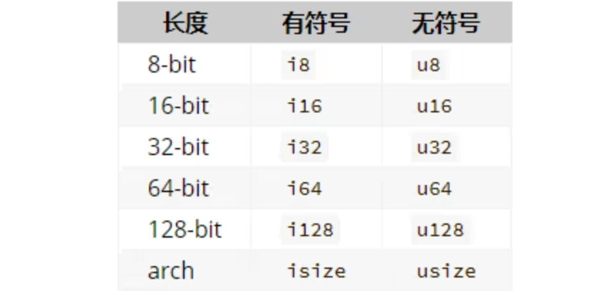

# Rust 初阶（一）


最近开始学习 Rust，主要是阅读[Rust 中文文档](https://rustwiki.org/docs/) 中的资料。

开始阅读[《Rust 权威指南》](https://kaisery.github.io/trpl-zh-cn/title-page.html) 和 [附带练习的英文版](https://rust-book.cs.brown.edu/experiment-intro.html) ，并在此记下相关笔记，方便回顾。

## 安装/创建/启动/依赖

官网下载 Rustup，需要安装 VS。安装完 Rustup，会包括包管理工具 Cargo，常用命令如下：

-   `cargo build` 构建项目
-   `cargo run` 编译并运行项目
-   `cargo test` 测试项目
-   `cargo doc` 为项目构建文档
-   `cargo publish` 将库发布到 [crates.io](https://crates.io/)。
-   `cargo --version` 检查是否安装
-   `cargo check` 快速检查代码是否可编译
-   `cargo doc --open` 构建本地依赖的文档并在浏览器打开。

创建并运行新项目：

```bash
$ cargo new test-rust
$ cd test-rust
$ cargo run
```

Rust 的依赖包称作 crates，添加方式是在 Cargo.toml 添加相关依赖：

```toml
[dependencies]
ferris-says = "0.3.1"
```

接着运行 `cargo build`，就会安装该依赖，并创建 Cargo.lock 文件，构建项目。

执行`cargo run`即可编译运行该程序。

Rust 是一种 **预编译静态类型**（*ahead-of-time compiled*）语言，这意味着你可以编译程序，并将可执行文件送给其他人，他们甚至不需要安装 Rust 就可以运行。

不创建项目，直接使用 rustc 进行代码运行也是可以的：

```bash
$ rustc main.rs
```

使用 `cargo build --release` 优化编译项目，可执行文件生成在 target/release 文件夹下而不是 target/debug 下。

Cargo does not watch your files by default. But you can use plugins like [cargo-watch](https://crates.io/crates/cargo-watch) for this purpose.

## 库及 cargo

标准库 std。

需要升级 crate 时，Cargo 提供了这样一个命令，`update`，它会忽略 *Cargo.lock* 文件，并计算出所有符合 *Cargo.toml* 声明的最新版本。

运行 `cargo doc --open` 命令来构建所有本地依赖提供的文档，并在浏览器中打开。

## 基础概念

main 函数是程序的入口。

`::` 表示是类的实例方法。

`&` 表示这个参数是一个 **引用**（*reference*），它允许多处代码访问同一处数据，而无需在内存中多次拷贝。

范围表达式 `start..=end`。

Rust 代码中的函数和变量名使用 *snake case* 规范风格。在 snake case 中，所有字母都是小写并使用下划线分隔单词。

### 变量

在 Rust 中，变量默认是不可变的，可变变量使用 mut 声明，常量用 const 声明。

```rust
let apples = 5; // 不可变变量
let mut bananas = 5; // 可变变量
const THREE_HOURS_IN_SECONDS: u32 = 60 * 60 * 3; // 常量
// Rust 对常量的命名约定是在单词之间使用全大写加下划线。
```

> 常量与不可变变量有什么区别？
>
> -   变量能够通过 let 重新声明进行覆盖。覆盖的同时可以改变数据的类型。
> -   const 可以在全局作用域中使用，而 let 只能在函数中使用。

### 数据类型

Rust 有四种基本的标量类型：整型、浮点型、布尔类型和字符类型。

#### 整型




有符号的变体可以储存包含从 -(2**(n - 1)) 到 2**(n - 1) - 1 在内的数字。

无符号的变体可以储存从 0 到 2**(n - 1) 的数字。

`isize` 和 `usize` 类型依赖运行程序的计算机架构：64 位架构上它们是 64 位的，32 位架构上它们是 32 位的。

数字类型默认是 i32。

#### 浮点型

浮点型包括 f32 和 f64，都是有符号的，默认是 f64。

```rust
fn main() {
    let x = 2.0; // f64
    let y: f32 = 3.0; // f32
}
```

#### 布尔类型

true 和 false。

#### 字符类型

char 类型，Rust 的 `char` 类型的大小为四个字节 (four bytes)，并代表了一个 Unicode 标量值（Unicode Scalar Value），这意味着它可以比 ASCII 表示更多内容。

用单引号声明 `char` 字面量，而与之相反的是，使用双引号声明字符串字面量。

#### 复合类型

复合类型包括数组和元组，数组和元组的长度都是固定的，主要区别在于类型是否相同。

元组是一个将多个其他类型的值组合进一个复合类型的主要方式。

```rust
fn main() {
    let tup: (i32, f64, u8) = (500, 6.4, 1);
    // let tup = (500, 6.4, 1); // 直接声明也可以
    let (x, y, z) = tup; // 可以进行解构
}
```

也可以使用点号（`.`）后跟值的索引来直接访问它们。

```rust
fn main() {
    let x: (i32, f64, u8) = (500, 6.4, 1);
​
    let five_hundred = x.0;
​
    let six_point_four = x.1;
​
    let one = x.2;
}
```

另一个包含多个值的方式是 **数组**（*array*）。与元组不同，数组中的每个元素的类型必须相同。Rust 中的数组与一些其他语言中的数组不同，Rust 中的数组长度是固定的。

数组是可以在栈 (stack) 上分配的已知固定大小的单个内存块。可以使用索引来访问数组的元素。

```rust
fn main( ){
    let a: [i32; 5] = [1, 2, 3, 4, 5];
    // 或者 let a = [1, 2, 3, 4, 5];
    let a = [3, 3, 3, 3, 3];
    // 相同数字可以 let a = [3; 5];
}
​
//============ 复杂一点的例子
​
fn main() {
  let t = ([1; 2], [3; 4]);
  let (a, b) = t;
  println!("{}", a[0] + t.1[0]); 
}
```

### 函数

使用 fn 定义函数。Rust 不关心函数定义所在的位置，只要函数被调用时出现在调用之处可见的作用域内就行。

参数 *parameter*（形参） 和 *argument*（实参） 。

在函数签名中，**必须** 声明每个参数的类型。要求在函数定义中提供类型注解，意味着编译器再也不需要你在代码的其他地方注明类型来指出你的意图。

**语句**（*Statements*）是执行一些操作但不返回值的指令。 **表达式**（*Expressions*）计算并产生一个值。例如下面会产生错误：

```rust
fn main() {
    let x = (let y = 6); // let 语句不返回值
}
```

> 除了声明语句之外好像都是表达式。表达式加了分号之后就是语句了。

用大括号创建的块作用域也是一个表达式，如：

```rust
fn main() {
    let y = { // 这是一个表达式
        let x = 3;
        x + 1 // 表达式的结尾没有分号。如果在表达式的结尾加上分号，它就变成了语句，而语句不会返回值。
    };
​
    println!("The value of y is: {y}");
}
```

函数可以向调用它的代码返回值。要在箭头（`->`）后声明它的类型。在 Rust 中，函数的返回值等同于函数体最后一个表达式的值。使用 `return` 关键字和指定值，可从函数中提前返回；但大部分函数隐式的返回最后的表达式。

```rust
fn main() {
    let x = plus_one(5);
​
    println!("The value of x is: {x}");
}
​
fn plus_one(x: i32) -> i32 {
    x + 1  // 最后一个表达式的值为返回值，如果加了分号，会报错
}
```

### 控制流

主要是 if 表达式和循环。

if 表达式基本使用如下：

```rust
fn main() {
    let number = 3;
​
    if number < 5 { // 条件语句必须返回 bool 值
        println!("condition was true");
    } else {
        println!("condition was false");
    }
}
// else-if 分支
fn main() {
    let number = 6;
​
    if number % 4 == 0 {
        println!("number is divisible by 4");
    } else if number % 3 == 0 {
        println!("number is divisible by 3");
    } else if number % 2 == 0 {
        println!("number is divisible by 2");
    } else {
        println!("number is not divisible by 4, 3, or 2");
    }
}
```

`if` 是一个表达式，我们可以在 `let` 语句的右侧使用它：

```rust
fn main() {
    let condition = true;
    let number = if condition { 5 } else { 6 };
​
    println!("The value of number is: {number}");
}
```

Rust 有三种循环：`loop`、`while` 和 `for`。

loop 会无限循环，直到遇到 break。另外 loop 是表达式，break 的返回值为该表达式的返回值。

```rust
fn main() {
    let mut counter = 0;
​
    let result = loop {
        counter += 1;
​
        if counter == 10 {
            break counter * 2;
        }
    };
​
    println!("The result is {result}");
}
```

如果存在嵌套循环，`break` 和 `continue` 应用于此时最内层的循环。你可以选择在一个循环上指定一个 **循环标签**（*loop label*），然后将标签与 `break` 或 `continue` 一起使用，使这些关键字应用于已标记的循环而不是最内层的循环。下面是一个包含两个嵌套循环的示例：

```rust
fn main() {
    let mut count = 0;
    'counting_up: loop {
        println!("count = {count}");
        let mut remaining = 10;
​
        loop {
            println!("remaining = {remaining}");
            if remaining == 9 {
                break;
            }
            if count == 2 {
                break 'counting_up; // 跳出 'counting_up 循环，往下走
            }
            remaining -= 1;
        }
​
        count += 1;
    }
    println!("End count = {count}"); // 为 2
}
```

> 个人认为这不是一个很好的代码逻辑，当存在需要使用标签进行跳出循环的时候，考虑优化一下代码逻辑。

while 循环：

```rust
fn main() {
    let mut number = 3;
​
    while number != 0 {
        println!("{number}!");
​
        number -= 1;
    }
​
    println!("LIFTOFF!!!");
}
```

for 循环：

```rust
fn main() {
    let a = [10, 20, 30, 40, 50];
​
    for element in a {
        println!("the value is: {element}");
    }
}
​
// 另外的用法
fn main() {
    for number in (1..4).rev() {
        println!("{number}!"); // 3，2，1
    }
    println!("LIFTOFF!!!");
}
```

## 所有权

Rust 通过所有权系统管理内存，不需要进行垃圾回收。

### 所有权规则

-   Rust 中的每一个值都有一个所有者；
-   值在任一时刻有且只有一个所有者；
-   当所有者(变量)离开作用域，这个值将被丢弃。

### 栈和堆

在像 Rust 这样的系统编程语言中，值是位于栈上还是堆上在更大程度上影响了语言的行为以及为何必须做出这样的抉择。

入栈比在堆上分配内存要快，因为（入栈时）分配器无需为存储新数据去搜索内存空间；其位置总是在栈顶。相比之下，在堆上分配内存则需要更多的工作，这是因为分配器必须首先找到一块足够存放数据的内存空间，并接着做一些记录为下一次分配做准备。

访问堆上的数据比访问栈上的数据慢，因为必须通过指针来访问。现代处理器在内存中跳转越少就越快（缓存）。

### 变量与数据交互规则

#### 一、移动 move

下列这种方式称为移动，s1 赋值给 s2 后，s1 会被销毁：

```rust
let s1 = String::from("hello");
let s2 = s1;
​
println!("{}, world!", s1); // 报错
```

Rust 永远也不会自动创建数据的 “深拷贝”。因此，任何 **自动** 的复制可以被认为对运行时性能影响较小。

#### 二、克隆 clone

使用 clone 通用函数，进行深度复制：

```rust
let s1 = String::from("hello");
let s2 = s1.clone();
​
println!("s1 = {}, s2 = {}", s1, s2); // 正常
```

一些实现了 Copy trait 的类型，可以在旧的变量赋值给新变量的时候仍然可用，一些 Copy 的类型如下：

-   整数、浮点数、布尔类型、字符类型(char)
-   元组、数组，当且仅当其包含的类型也都实现 Copy 的时候

### 将值传递给函数的情况

当值传递给函数的时候，所有权进行了转义，调用函数之后的地方就不能再使用失去所有权的变量了。

```rust
fn main() {
    let s = String::from("hello");  // s 进入作用域
​
    takes_ownership(s); // s 的值移动到函数里 ...
                                    // ... 所以到这里不再有效
​
    let x = 5;                 // x 进入作用域
​
    makes_copy(x);     // x 应该移动函数里，
                                    // 但 i32 是 Copy 的，
                                    // 所以在后面可继续使用 x
​
} // 这里，x 先移出了作用域，然后是 s。但因为 s 的值已被移走，
  // 没有特殊之处
​
fn takes_ownership(some_string: String) { // some_string 进入作用域
    println!("{}", some_string);
} // 这里，some_string 移出作用域并调用 `drop` 方法。
  // 占用的内存被释放
​
fn makes_copy(some_integer: i32) { // some_integer 进入作用域
    println!("{}", some_integer);
} // 这里，some_integer 移出作用域。没有特殊之处
```

函数返回值可以将所有权进行返回

```rust
fn main() {
    let s1 = gives_ownership();         // gives_ownership 将返回值
                                        // 转移给 s1
​
    let s2 = String::from("hello");     // s2 进入作用域
​
    let s3 = takes_and_gives_back(s2);  // s2 被移动到
                                        // takes_and_gives_back 中，
                                        // 它也将返回值移给 s3
    println!("{}，{}", s1,s3);
​
} // 这里，s3 移出作用域并被丢弃。s2 也移出作用域，但已被移走，
  // 所以什么也不会发生。s1 离开作用域并被丢弃
​
fn gives_ownership() -> String {             // gives_ownership 会将
                                             // 返回值移动给
                                             // 调用它的函数
​
    let some_string = String::from("yours"); // some_string 进入作用域。
​
    some_string                              // 返回 some_string 
                                             // 并移出给调用的函数
}
​
// takes_and_gives_back 将传入字符串并返回该值
fn takes_and_gives_back(a_string: String) -> String { // a_string 进入作用域
                                                      // 
    a_string  // 返回 a_string 并移出给调用的函数
}
```

变量的所有权总是遵循相同的模式：将值赋给另一个变量时移动它。当持有堆中数据值的变量离开作用域时，其值将通过 `drop` 被清理掉，除非数据被移动为另一个变量所有。

The stack holds data associated with a specific function, while the heap holds data that can outlive a function（栈保存与特定函数关联的数据，而堆保存可以比函数寿命更长的数据）

```rust
fn main() {
  let s = String::from("hello");
  let s2;
  let b = false;
  if b { // rust 通常不会确定 if 是否会执行，这里会判断 s 被移动了
    s2 = s;
  }
  println!("{}", s); // 报错，s 被 move 了
}
```

### 引用与借用

引用允许你使用值但是不获取所有权。

> 与此相反的还有解引用「*」

创建一个引用的行为成为「借用」。

默认不允许修改引用的值。

要修改引用的值，需要创建可变引用。

**可变引用有一个很大的限制：如果你有一个对该变量的可变引用，你就不能再创建对该变量的引用。**

```rust
let mut s = String::from("hello");
​
let r1 = &mut s;
let r2 = &mut s; // 报错
​
println!("{}, {}", r1, r2); 
```

该限制是为了避免数据竞争：

-   两个以上指针同时访问同一数据；
-   至少有一个指针被用来写入数据；
-   没有同步数据访问的机制。

可以使用大括号来创建一个新的作用域，以允许拥有多个可变引用：

```rust
fn main() {
    let mut s = String::from("hello");
​
    {
        let r1 = &mut s;
    } // r1 在这里离开了作用域，所以我们完全可以创建一个新的引用
​
    let r2 = &mut s;
​
    println!("{}", r2);
}
```

**不能在拥有不可变引用的同时拥有可变引用**。但是多个不可变引用是允许的。

```rust
fn main() {
    let mut s = String::from("hello");
​
    let r1 = &s; // 没问题
    let r2 = &s; // 没问题
    let r3 = &mut s; // 大问题
​
    println!("{}, {}, and {}", r1, r2, r3);
}
​
// 但是以下情况是可以的：
fn main() {
    let mut s = String::from("hello");
​
    let r1 = &s; // 没问题
    let r2 = &s; // 没问题
    println!("{} and {}", r1, r2);
    // 此位置之后 r1 和 r2 不再使用
​
    let r3 = &mut s; // 没问题
    println!("{}", r3);
}
```

rust 会避免悬垂指针的存在：

```rust
fn dangle() -> &String { // dangle 返回一个字符串的引用
​
    let s = String::from("hello"); // s 是一个新字符串
​
    &s // 返回字符串 s 的引用
} // 这里 s 离开作用域并被丢弃。其内存被释放。
  // 危险！
```

### 字符串引用

**字符串 slice**（*string slice*）是 `String` 中一部分值的引用：

```rust
let s = String::from("hello world");
​
let hello = &s[0..5];
let world = &s[6..11];
```

对于 Rust 的 `..` range 语法，如果想要从索引 0 开始，可以不写两个点号之前的值：

```rust
let s = String::from("hello");
​
let slice = &s[0..2];
let slice = &s[..2];
// 或者不写尾部
let len = s.len();
let slice = &s[3..len];
let slice = &s[3..];
// 或者前后都不写
let slice = &s[0..len];
let slice = &s[..];
```

String slice 类型是用 &str 标识。

字符串字面值就是 &str 类型，一个不可变引用，它是一个指向二进制程序特定位置的 slice。

```rust
let s = "Hello, world!";
```

通常函数签名如下：

```rust
fn first_word(s: &str) -> &str {/.../}
```

针对其他类型也有通用的 slice 类型。

References are **non-owning pointers**, because they do not own the data they point to. 引用是非拥有指针，因为它们不拥有它们所指向的数据。

### 取消引用指针

```rust
let mut x: Box<i32> = Box::new(1);
let a: i32 = *x;         // *x reads the heap value, so a = 1
*x += 1;                 // *x on the left-side modifies the heap value,
                         //     so x points to the value 2
​
let r1: &Box<i32> = &x;  // r1 points to x on the stack
let b: i32 = **r1;       // two dereferences get us to the heap value
​
let r2: &i32 = &*x;      // r2 points to the heap value directly
let c: i32 = *r2;    // so only one dereference is needed to read it
```

一般不会看到解引用运算符，Rust 在某些情况下会隐式插入取消引用和引用：

```rust
let x: Box<i32> = Box::new(-1);
let x_abs1 = i32::abs(*x); // explicit dereference
let x_abs2 = x.abs();      // implicit dereference
assert_eq!(x_abs1, x_abs2);
​
let r: &Box<i32> = &x;
let r_abs1 = i32::abs(**r); // explicit dereference (twice)
let r_abs2 = r.abs();       // implicit dereference (twice)
assert_eq!(r_abs1, r_abs2);
​
let s = String::from("Hello");
let s_len1 = str::len(&s); // explicit reference
let s_len2 = s.len();      // implicit reference
assert_eq!(s_len1, s_len2);
```

## 结构体

简单使用：

```rust
struct User {
    active: bool,
    username: String,
    email: String,
    sign_in_count: u64,
}
​
fn main() {
    let mut user1 = User {
        active: true,
        username: String::from("someusername123"),
        email: String::from("someone@example.com"),
        sign_in_count: 1
    };
​
    user1.email = String::from("anotheremail@example.com");
}
```

注意整个实例必须是可变的；Rust 并不允许只将某个字段标记为可变。另外需要注意同其他任何表达式一样，我们可以在函数体的最后一个表达式中构造一个结构体的新实例，来隐式地返回这个实例。

**字段初始化简写语法**（这里与 JS 类似）：

```rust
fn build_user(email: String, username: String) -> User {
    User {
        active: true,
        username: username,
        email: email,
        sign_in_count: 1,
    }
}
// 等同于下面
fn build_user(email: String, username: String) -> User {
    User {
        active: true,
        username,
        email,
        sign_in_count: 1,
    }
}
```

**结构体更新语法**（类似于解构赋值），从其他实例创建实例：

```rust
fn main() {
    // --snip--
​
    let user2 = User {
        active: user1.active,
        username: user1.username,
        email: String::from("another@example.com"),
        sign_in_count: user1.sign_in_count,
    };
}
// 等同于下面，与 JS 不同的是，后面不会覆盖前面
fn main() {
    // --snip--
​
    let user2 = User {
        email: String::from("another@example.com"),
        ..user1 // ..user1 必须放在最后，以指定其余的字段应从 user1 的相应字段中获取其值
    };
}
```

总体上说我们在创建 `user2` 后不能就再使用 `user1` 了，因为 `user1` 的 `username` 字段中的 `String` 被移到 `user2` 中。如果我们给 `user2` 的 `email` 和 `username` 都赋予新的 `String` 值，从而只使用 `user1` 的 `active` 和 `sign_in_count` 值，那么 `user1` 在创建 `user2` 后仍然有效。

#### 元组结构体

简单使用如下：

```rust
struct Color(i32, i32, i32);
struct Point(i32, i32, i32);
​
fn main() {
    let black = Color(0, 0, 0);
    let origin = Point(0, 0, 0);
}
```

#### 类单元结构体

没有任何字段的结构体！它们被称为 **类单元结构体**（*unit-like structs*）因为它们类似于 `()`，即[“元组类型”](https://kaisery.github.io/trpl-zh-cn/ch03-02-data-types.html#%E5%85%83%E7%BB%84%E7%B1%BB%E5%9E%8B)一节中提到的 unit 类型。类单元结构体常常在你想要在某个类型上实现 trait 但不需要在类型中存储数据的时候发挥作用。

```rust
struct AlwaysEqual;
​
fn main() {
    let subject = AlwaysEqual;
}
```

* * *

生命周期确保结构体引用的数据有效性跟结构体本身保持一致。如果你尝试在结构体中存储一个引用而不指定生命周期将是无效的。

* * *

### 关于调试

`println!` 宏能处理很多类型的格式，不过，`{}` 默认告诉 `println!` 使用被称为 `Display` 的格式：意在提供给直接终端用户查看的输出。目前为止见过的基本类型都默认实现了 `Display`，因为它就是向用户展示 `1` 或其他任何基本类型的唯一方式。不过对于结构体，`println!` 应该用来输出的格式是不明确的，因为这有更多显示的可能性：是否需要逗号？需要打印出大括号吗？所有字段都应该显示吗？由于这种不确定性，Rust 不会尝试猜测我们的意图，所以结构体并没有提供一个 `Display` 实现来使用 `println!` 与 `{}` 占位符。

可以通过 debug 模式进行信息的打印：

```rust
#[derive(Debug)]
​
struct Rectangle {
    width: u32,
    height: u32,
}
​
​
fn main() {
    let rect1 = Rectangle {
        width: 30,
        height: 50,
    };
​
    println!("rect1 is {:?}", rect1); // 使用 debug 模式打印
    println!("rect1 is {:#?}", rect1); // 更易读的模式
​
    println!(
        "The area of the rectangle is {} square pixels.",
        area(&rect1)
    );
}
​
fn area(rectangle: &Rectangle) -> u32 {
    rectangle.width * rectangle.height
}
```

另一种使用 `Debug` 格式打印数值的方法是使用 [`dbg!` 宏](https://doc.rust-lang.org/std/macro.dbg.html)。`dbg!` 宏接收一个表达式的所有权（与 `println!` 宏相反，后者接收的是引用）

> 注意：调用 `dbg!` 宏会打印到标准错误控制台流（`stderr`），与 `println!` 不同，后者会打印到标准输出控制台流（`stdout`）。

```rust
#[derive(Debug)]
struct Rectangle {
    width: u32,
    height: u32,
}
​
fn main() {
    let scale = 2;
    let rect1 = Rectangle {
        width: dbg!(30 * scale), // 返回表达式值的所有权
        height: 50,
    };
​
    dbg!(&rect1); // 不希望拥有react1的所有权，所以传递引用
    
    println!(
        "The area of the rectangle is {} square pixels.",
        area(&rect1)
    );
}
​
fn area(rectangle: &Rectangle) -> u32 {
    rectangle.width * rectangle.height
}
```

### 方法

**方法**（method）与函数类似：它们使用 `fn` 关键字和名称声明，可以拥有参数和返回值，同时包含在某处调用该方法时会执行的代码。

方法与函数不同：

-   定义位置不同，在结构体或者其它对象中；
-   第一个参数总是 `self`，代表调用该方法的结构体实例。

实例如下：

```rust
struct Rectangle {
    width: u32,
    height: u32,
}
​
impl Rectangle { // 在 Rectangle 上定义 area 方法， impl -> implementation
    fn area(&self) -> u32 {  // &self 是 self: &self 的缩写，在一个 impl 块中，Self 类型是 impl 块的类型的别名。
        self.width * self.height
    }
}
​
fn main() {
    let rect1 = Rectangle {
        width: 30,
        height: 50,
    };
​
    println!(
        "The area of the rectangle is {} square pixels.",
        rect1.area()
    );
}
```

impl 块使函数定义在结构体 Rectangle 的上下文中。结构体实例通过「.」运算符进行方法的调用。

方法可以选择获得 `self` 的所有权，或不可变地借用 `self`，或可变地借用 `self`。如果想要在方法中改变调用方法的实例，需要将第一个参数改为 `&mut self`。

可以选择将方法的名称与结构中的一个字段相同，有括号的时候是方法调用，没有括号的时候是字段。

```rust
impl Rectangle {
    fn width(&self) -> bool {
        self.width > 0
    }
}
​
fn main() {
    let rect1 = Rectangle {
        width: 30,
        height: 50,
    };
​
    if rect1.width() {
        println!("The rectangle has a nonzero width; it is {}", rect1.width);
    }
}
```

Rust 有一个叫 **自动引用和解引用**（*automatic referencing and dereferencing*）的功能。方法调用是 Rust 中少数几个拥有这种行为的地方。

每个结构体都允许拥有多个 `impl` 块。

例如：

```rust
impl Rectangle {
    fn area(&self) -> u32 {
        self.width * self.height
    }
}
​
impl Rectangle {
    fn can_hold(&self, other: &Rectangle) -> bool {
        self.width > other.width && self.height > other.height
    }
}
```

#### 关联函数

结构体可以定义不以 self 为第一个参数的关联函数（不是方法）。通常被用作返回一个结构体新实例的构造函数，如`String::from`。

这些函数的名称通常为 `new` ，但 `new` 并不是一个关键字。例如我们可以提供一个叫做 `square` 关联函数，它接受一个维度参数并且同时作为宽和高。

```rust
impl Rectangle {
    fn square(size: u32) -> Self {
        Self {
            width: size,
            height: size,
        }
    }
}
```

#### 综合示例

```rust
#[derive(Debug)]
struct Rectangle {
    width: u32,
    height: u32,
}
​
impl Rectangle { // 在 Rectangle 上定义 area 方法， impl -> implementation
    fn area(&self) -> u32 {  // &self 是 self: &self 的缩写，在一个 impl 块中，Self 类型是 impl 块的类型的别名。
        self.width * self.height
    }
    fn can_hold(&self, other: &Rectangle) -> bool { // 多参数的方法
        self.width > other.width && self.height > other.height
    }
    fn width(&self) -> bool { // 与字段名同名的方法
        self.width > 0
    }
}
// 多 impl 块
impl Rectangle {
    fn square(size: u32) -> Self { // 不是以 self 为第一个参数，关联函数
        Self {
            width: size,
            height: size,
        }
    }
    fn nothing() {
        println!("nothing just test");
    }
}
​
fn main() {
    let rect1 = Rectangle {
        width: 30,
        height: dbg!(25 * 2), // debug 输出并返回所有权
    };
​
    dbg!(&rect1); // debug 输出
    if rect1.width() {
        println!("The rectangle has a nonzero width; it is {}", rect1.width);
    }
    println!(
        "The area of the rectangle is {} square pixels.",
        rect1.area()
    );
​
    let rect2 = Rectangle {
        width: 10,
        height: 40,
    };
    let rect3 = Rectangle {
        width: 60,
        height: 45,
    };
    let rect4 = Rectangle::square(25); // 使用关联函数创造实例
    dbg!(&rect4);
    Rectangle::nothing(); // 测试不返回实例的关联函数
​
    println!("Can rect1 hold rect2? {}", rect1.can_hold(&rect2));
    println!("Can rect1 hold rect3? {}", rect1.can_hold(&rect3));
    println!("Can rect1 hold rect4? {}", rect1.can_hold(&rect4));
}
```

## 枚举和模式匹配

### 枚举

枚举 名称用大写字母开头，大驼峰式。

> const 常量用连字符分割的大写单词命名。
>
> struct 用大驼峰式，枚举用大驼峰式。

定义使用枚举：

```rust
// 定义枚举
enum IpAddrKind {
    V4,
    V6
}
// 使用枚举
fn main() {
    let four = IpAddrKind::V4;
    let six = IpAddrKind: V6;
    // ...
}
```

在枚举值中存储数据：

```rust
enum IpAddr {
    V4(u8, u8, u8, u8),
    V6(String),
}
​
let home = IpAddr::V4(127, 0, 0, 1);
​
let loopback = IpAddr::V6(String::from("::1"));
​
// 标准库中的定义，表名可以将任意类型嵌入到枚举成员中
struct Ipv4Addr {
    // --snip--
}
struct Ipv6Addr {
    // --snip--
}
enum IpAddr {
    V4(Ipv4Addr),
    V6(Ipv6Addr),
}
```

存储不同成员的枚举，类似于多种结构体：

```rust
enum Message {
    Quit,
    Move { x: i32, y: i32 },
    Write(String),
    ChangeColor(i32, i32, i32),
}
// 类似于
struct QuitMessage; // 类单元结构体
struct MoveMessage {
    x: i32,
    y: i32,
}
struct WriteMessage(String); // 元组结构体
struct ChangeColorMessage(i32, i32, i32); // 元组结构体
```

定义成枚举的好处是，能够定义一个处理不同类型的数据的函数。枚举也可以用 impl 来定义方法：

```rust
impl Message {
    fn call(&self) {
        
    }
}
​
let m = Message::Write(String::from("hello"));
m.call();
```

#### 综合示例

```rust
#[derive(Debug)]
enum Message {
    Quit,
    Move { x: i32, y: i32 },
    Write(String),
    ChangeColor(i32, i32, i32),
}
​
impl Message {
    fn call(&self) {
        dbg!(self);
        // 通过模式匹配获取值，下一节了解
         match self {
            Message::Write(str) => {
                dbg!(str);
            },
            _ => {
                println!("other thing");
            }
        }
    }
}
​
fn main() {
    let m = Message::Write(String::from("hello"));
    m.call();
}
```

### 空值

`Option<T>` 枚举是标准库定义的枚举，用于提供空值。Rust 没有空值。

不需要将其显式引入作用域。不需要 `Option::` 前缀来直接使用 `Some` 和 `None`。

```rust
fn main() {
    let some_number = Some(5);
    let some_number2 = Option::Some(5);
    let nothing: Option<char> = None;
    dbg!(some_number ==  some_number2); // true
}
```

那么当有一个 `Option<T>` 的值时，如何从 `Some` 成员中取出 `T` 的值来使用它呢？`Option<T>` 枚举拥有大量用于各种情况的方法：你可以查看[它的文档](https://doc.rust-lang.org/std/option/enum.Option.html)。熟悉 `Option<T>` 的方法将对你的 Rust 之旅非常有用。

### match 控制流结构

match 允许我们将一个值与一系列的模式相比较，根据相匹配的模式执行相应的代码。

```rust
enum Coin {
    Penny,
    Nickel,
    Dime,
    Quarter,
}
​
fn value_in_cents(coin: Coin) -> u8 {
    match coin {
        Coin::Penny => {
            println!("Lucky penny!");
            1
        }
        Coin::Nickel => 5,
        Coin::Dime => 10,
        Coin::Quarter => 25,
    }
}
​
fn main() {
    let num = Coin::Penny;
    dbg!(value_in_cents(num));
}
```

与 switch-case 不同，不会往下走，不需要 break。

#### 绑定值的模式（获取枚举中绑定的值）

假设在 Coin 枚举中有一个枚举是绑定了值，可以通过匹配模式获取到该值：

```rust
#[derive(Debug)] // 这样可以立刻看到州的名称
enum UsState {
    Alabama,
    Alaska,
    // --snip--
}
​
enum Coin {
    Penny,
    Nickel,
    Dime,
    Quarter(UsState),
}
​
fn value_in_cents(coin: Coin) -> u8 {
    match coin {
        Coin::Penny => {
            println!("Lucky penny!");
            1
        }
        Coin::Nickel => 5,
        Coin::Dime => 10,
        Coin::Quarter(state) => { // 绑定值的匹配模式，可以获取值
            println!("State quarter from {:?}!", state);
            25
        }
    }
}
​
fn main() {
    let coin = Coin::Quarter(UsState::Alabama);
    dbg!(value_in_cents(coin));
}
```

另一个示例，匹配 `Option<T>` 中的值：

```rust
fn main() {
    fn plus_one(x: Option<i32>) -> Option<i32> {
        match x {
            None => None,
            Some(i) => Some(i + 1),
        }
    }
​
    let five = Some(5);
    let six = plus_one(five);
    let none = plus_one(None);
​
    dbg!(six);
    dbg!(none);
}
```

#### 通配模式和 _ 占位符

Rust 中的匹配是 **穷尽的**（*exhaustive*）：必须穷举到最后的可能性来使代码有效。

有时候只需要对部分值进行操作，其它值使用默认操作，可使用 other（实测任意名称均可，default等） 或者 「_」占位符。

必须将通配分支放在最后，因为模式是按顺序匹配的。

当我们不想使用通配模式获取的值时，请使用 `_` ，这是一个特殊的模式，可以匹配任意值而不绑定到该值。

```rust
let dice_roll = 9;
match dice_roll {
    3 => add_fancy_hat(),
    7 => remove_fancy_hat(),
    other => move_player(other), // 或者 default 都可，如果不使用该值，就用 _, 不会警告我们存在未使用的变量
}
​
fn add_fancy_hat() {}
fn remove_fancy_hat() {}
fn move_player(num_spaces: u8) {}
​
// 或者使用占位符和空元组
let dice_roll = 9;
match dice_roll {
    3 => add_fancy_hat(),
    7 => remove_fancy_hat(),
    _ => (), // 占位符及空元组
}
​
fn add_fancy_hat() {}
fn remove_fancy_hat() {}
```

### if let 简洁控制流

if let 语法是只匹配一个模式的值而忽略其他模式的情况。

示例如下：

```rust
let config_max = Some(3u8);
match config_max {
    Some(max) => println!("The maximum is configured to be {}", max),
    _ => (),
}
// 使用 if let 语法简化
let config_max = Some(3u8);
if let Some(max) = config_max {
    println!("The maximum is configured to be {}", max);
}
```

使用 `if let` 意味着编写更少代码，更少的缩进和更少的样板代码。然而，这样会失去 `match` 强制要求的穷尽性检查。`match` 和 `if let` 之间的选择依赖特定的环境以及增加简洁度和失去穷尽性检查的权衡取舍。