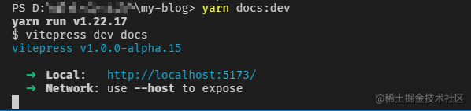
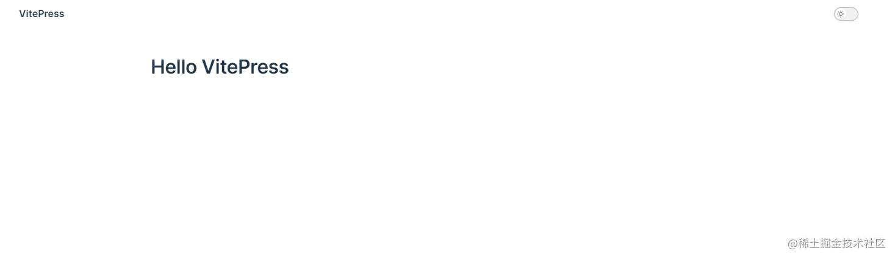
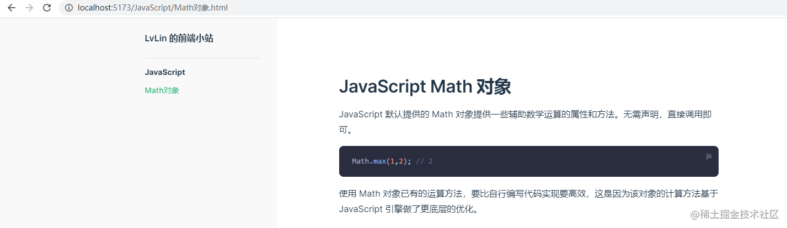
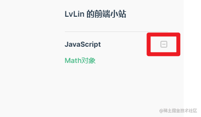
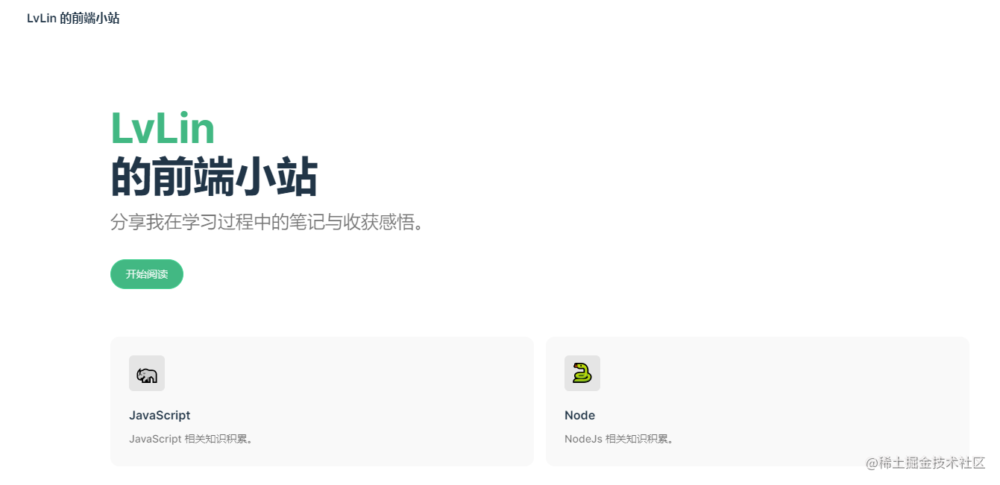
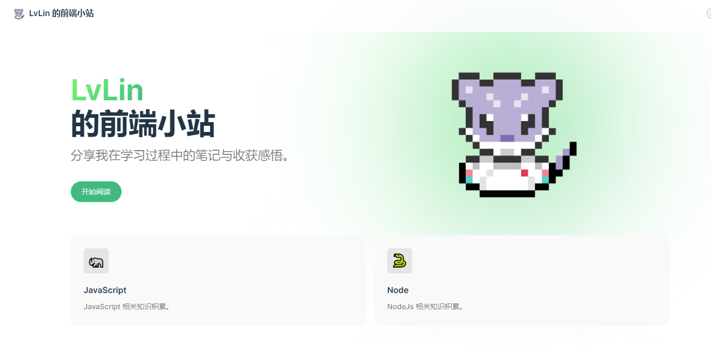

# vitepress 静态博客搭建

[vitePress](https://vitepress.vuejs.org/) 是一个基于 vite 和 vue 的静态博客生成器。简单、强大且高性能。


### 1. 本地化搭建


```bash
$ mkdir my-blog
$ cd my-blog
$ yarn init
# 或者 npm init
$ yarn add --dev vitepress vue
# 或者 npm i -D vitepress vue
```

创建一个文档在 docs 文件夹中，或者放入已有的文档：

```bash
$ mkdir docs && echo '# Hello VitePress' > docs/index.md
```

添加一些脚本到 `package.json` 中：

```json
{
  ...
  "scripts": {
    "docs:dev": "vitepress dev docs",
    "docs:build": "vitepress build docs",
    "docs:serve": "vitepress serve docs"
  },
  ...
}
```

启动开发环境服务：

```bash
$ yarn docs:dev
# 或者 npm run docs:dev
```



从浏览器访问页面：



接下来所有的变更都能够实时在页面上看到效果（即热更新）。

### 2. 主题及导航配置

在配置文档目录及页面导航之前，需要先配置一下主题。

`vitepress` 都是在 `docs/.vitepress` 目录下：

```js
.
├─ docs
│  ├─ .vitepress 
│  │  ├─ theme   
│  │  │  └─ index.js
│  │  └─ config.js 
│  └─ index.md
└─ package.json
```

`config.js` 下是基本配置，`theme` 下是主题配置。

配置默认主题：

```js
// .vitepress/theme/index.js
import DefaultTheme from 'vitepress/theme'

export default DefaultTheme;
```

在基本配置中配置标题与侧边栏导航：

```js
// .vitepress/config.js
export default {
  title: 'LvLin 的前端小站',
  description: '分享我的学习笔记与成长收获',
  themeConfig: {
    sidebar: [
      {
        text: 'JavaScript',
        items: [
          { text: 'Math对象', link: '/JavaScript/Math对象'},
        ]
      }
    ]
  }
}
```

这里我把自己的一篇文章`Math对象.md`放到了 `docs/JavaScrip` 目录下，在 `themeConfig.sidebar` 中，配置了一个指向 `JavaScript/Math对象.md` 文件的侧边栏导航。

页面效果如下：



如果希望侧边栏可折叠，就加一个配置项 `collapsible: true`：

```js
//...
sidebar: [
  {
    text: 'JavaScript',
    items: [
      { 
        text: 'Math对象',
        collapsible: true,
        link: '/JavaScript/Math对象'
      },
    ]
  }
]
//...
```

侧边栏就会有个折叠按钮：



### 3. 首页配置

修改一下 `docs/index.md` 文件，作为博客首页 👇。

```yaml
---
layout: home

hero:
    name: LvLin
    text: 的前端小站
    tagline: 分享我在学习过程中的笔记与收获感悟。
    actions:
        - theme: brand
          text: 开始阅读
          link: /JavaScript/Math对象
features:
    - icon: 🦏
      title: JavaScript
      details: JavaScript 相关知识积累。
    - icon: 🐍
      title: Node
      details: NodeJs 相关知识积累。
---
```

简单的静态博客页面就搭建完成了 👇。



### 4. 首页样式优化

##### 增加图片与图标

创建文件夹 `docs/public`，放入文件`logo.png` 和 `favicon.ico`。可以在 [iconfont](https://www.iconfont.cn/illustrations/detail?spm=a313x.7781069.1998910419.d9df05512&cid=40323) 看看有没有喜欢的图标。使用 [aconvert.com](https://www.aconvert.com/cn/icon/png-to-ico/) 可以将 `png` 图片转成 `ico` 图标文件。大小建议 `16x16` 或者 `24x24`。

在首页 `docs/index.md` 增加个 `image` 配置 👇：

```yaml
---
layout: home

hero:
    name: LvLin
    text: 的前端小站
    tagline: 分享我在学习过程中的笔记与收获感悟。
    image:
        src: /logo.png
        alt: Logo
    actions:
        - theme: brand
          text: 开始阅读
          link: /JavaScript/Math对象
features:
    - icon: 🦏
      title: JavaScript
      details: JavaScript 相关知识积累。
    - icon: 🐍
      title: Node
      details: NodeJs 相关知识积累。
---
```


在导航栏加上图片，在浏览器标签栏加上图标 ，修改 `docs/.vitepress/config.js` 文件配置 👇：

```js
// docs/.vitepress/config.js

export default {
    //...
    head: [
        ['link', { rel: 'icon', href: '/favicon.ico' }]
    ],
    themeConfig: {
        logo: '/logo.png',
        //...
    }
}
```


##### 设置渐变色

接下来给首页的标题和图标设置渐变色。

创建文件`docs/.vitepress/theme/style/custom.css` 👇：

```css
:root {
    /* 标题 */
    --vp-home-hero-name-color: transparent;
    --vp-home-hero-name-background: linear-gradient(135deg, #70F570 10%, #42b883 100%);

    /* 图标背景 */
    --vp-home-hero-image-background-image: linear-gradient(135deg, #70F570 10%, #42b883 100%);
    --vp-home-hero-image-filter: blur(150px);
}
```

具体效果如下所示：

